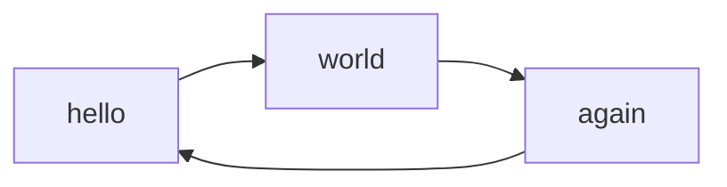
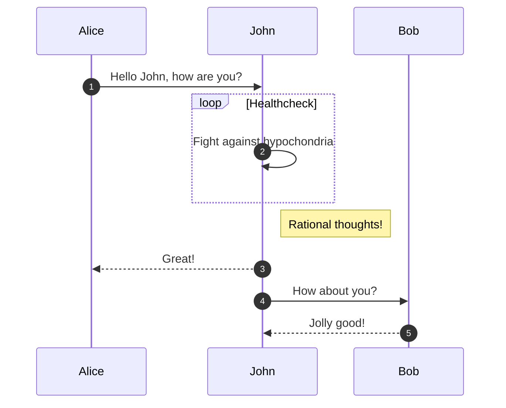

# Sample Page with a very long heading

!!! Warning
    Please do not delete this sample page.

## Overview

This is a sample page to get things started.

???+ Tip
    The `title:` area at the top of this document is optional, and is used as the nav title instead of the h1. This is useful if you have a longer h1.
    ??? Example "Show Code"
        ```md {title="Sample Page" hl_lines="2"}
        --8<-- "docs/sample/index.md"
        ```

## Mermaid Diagrams

**Flowchart**



**Sequence**



---

# Related Tags

<!-- material/tags scoped -->

---

# Related Pages

{pagelist 5 Sample}
